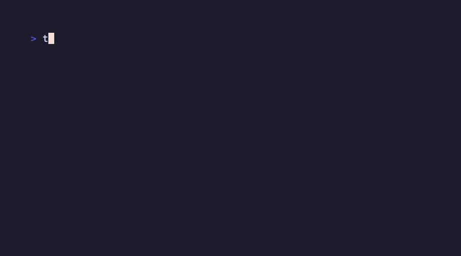

# try.rs · `try-me-maybe`

A Rust port of [tobi/try](https://github.com/tobi/try) — instant,
fuzzy-searchable, dated experiment directories. Your brain doesn't work in
neat folders; every experiment gets a home, and every home is instantly
findable.



> **Conformance target: tobi/try v1.9.3, byte for byte.** Upstream's own
> 37-test suite passes unmodified (387/387); fuzzy scoring matches upstream
> Ruby bit-for-bit. Details in [COMPAT.md](COMPAT.md).

- **Package:** `try-me-maybe` · **Binary:** `tryme` · **Your command:** `try`
  (the shell function `tryme init` emits) — no collision with upstream's
  Homebrew `try`; they coexist ([ADR-0001](docs/adr/0001-naming.md))

## Install

> Package channels go live with the first tagged release. Until then, build
> from source: `cargo install --git https://github.com/indexzero/try.rs try-me-maybe`

```sh
# mise
mise use -g cargo:try-me-maybe

# Homebrew (tap)
brew install indexzero/tap/try-me-maybe

# prebuilt binary
cargo binstall try-me-maybe

# from source (crates.io)
cargo install try-me-maybe
```

Then wire up the shell function (bash/zsh shown; fish works too):

```sh
# ~/.bashrc or ~/.zshrc
eval "$(tryme init ~/src/tries)"

# or let it edit your rc file for you (idempotent):
tryme install
```

## Usage

```sh
try                   # interactive selector over your tries
try fuz               # selector pre-filtered to "fuz" (fuzzy)
try clone https://github.com/user/repo    # clone into 2026-07-10-user-repo
try worktree feature-branch                # detached worktree from this repo
try . spike           # dated dir (or worktree) from the current directory
```

Inside the selector: type to filter · `↑/↓` or `Ctrl-P/N` navigate · `Enter`
select or create · `Ctrl-T` new try · `Ctrl-R` rename · `Ctrl-G` graduate a
try into a permanent project (leaves a symlink behind) · `Ctrl-D` mark for
deletion (type `YES` to confirm) · `Esc` cancel.

Every selection is emitted as a shell script on stdout and `eval`'d by the
wrapper — that's how a child process `cd`s your shell.

## Features

- **Byte-parity port**: the whole upstream conformance suite, unmodified,
  plus golden-frame and bit-exact-scoring fixtures generated from upstream
- Single static binary (musl on Linux); no runtime dependencies — `git` is
  shelled out to only in the scripts you `eval`
- Recency-weighted fuzzy ranking (selecting a try boosts it next time)
- bash, zsh, and fish wrappers; PowerShell via `tryme install`

## Configuration

| Env var | Meaning | Default |
|---|---|---|
| `TRY_PATH` | tries root | `~/src/tries` |
| `TRY_PROJECTS` | graduate destination | parent of `TRY_PATH` |
| `NO_COLOR` / `NO_COLORS` | disable ANSI styling | unset |
| `TRY_WIDTH` / `TRY_HEIGHT` | terminal size override | detected |

Flags: `--path PATH` (last wins), `--no-colors`, `--help`, `--version`.
Man page: `man tryme` · completions for bash/zsh/fish under
[`completions/`](completions/) — all generated from one committed
[usage](https://usage.jdx.dev) spec ([`try.usage.kdl`](try.usage.kdl)).

## How is this different?

| | this port | [tobi/try](https://github.com/tobi/try) (upstream) | [try-rs](https://crates.io/crates/try-rs) | [try-cli](https://crates.io/crates/try-cli) |
|---|---|---|---|---|
| Language | Rust | Ruby | Rust | Rust |
| Passes upstream's conformance suite | **387/387, unmodified** | yes (it's upstream) | not a stated goal | not a stated goal |
| Byte-identical scripts/frames/scoring | **yes (fixture-pinned)** | — | not a stated goal | not a stated goal |
| Needs Ruby at runtime | no | yes | no | no |

Upstream is the canonical tool — if you're happy with a Ruby dependency, use
it. The other Rust ports are independent reimplementations with their own
(good!) ideas; this one is a conformance port: same tool, no Ruby.

## Development

```sh
mise run ci           # fmt + clippy + nextest + smoke + conformance + docs freshness
mise run conformance  # upstream's suite against the release binary
hk install --mise     # pre-commit hooks (fmt, clippy, spec freshness)
```

Decisions live in [`docs/adr/`](docs/adr/); behavior authority and quirk
rulings in [ADR-0003](docs/adr/0003-divergence-authority.md); suite
provenance in [`spec/UPSTREAM`](spec/UPSTREAM).

## License

[MIT](LICENSE). Upstream tobi/try is MIT; the adopted suite under
`spec/tests/` retains upstream's copyright.
